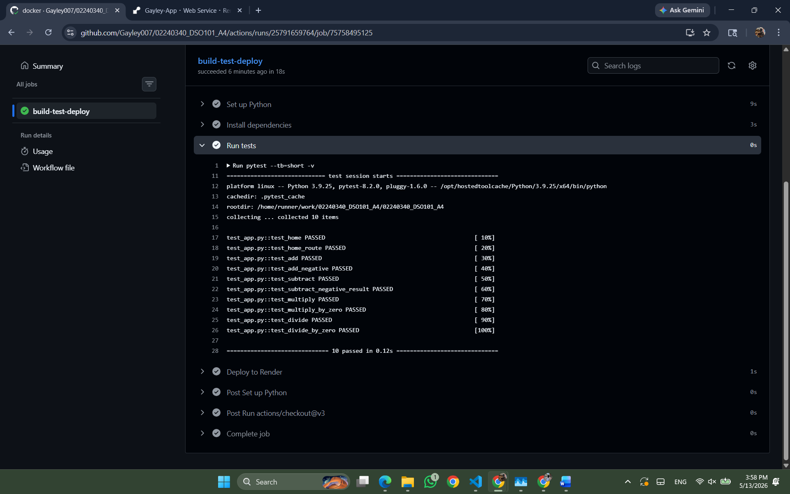
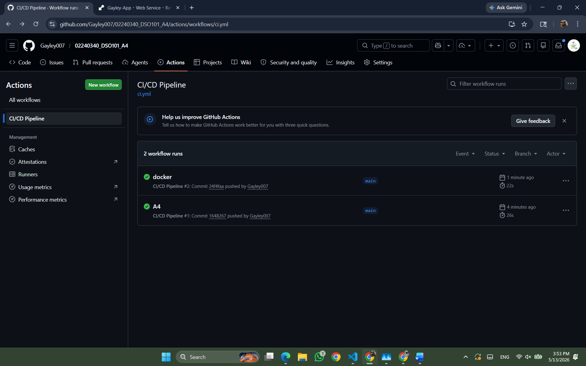
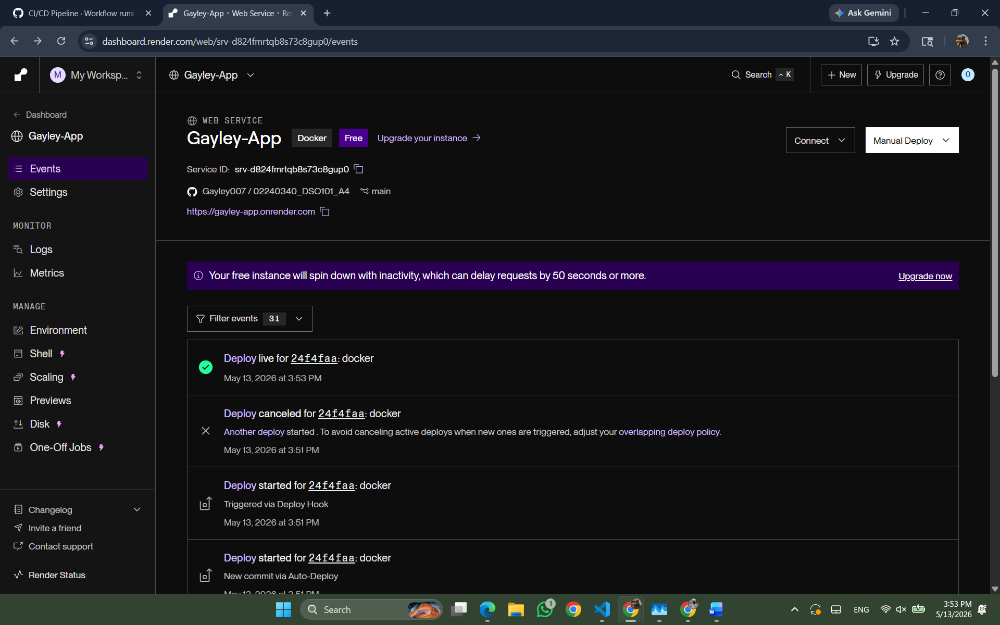

# DSO101 Assignment 4 - Complete CI/CD Pipeline with Testing & Deployment

**Name:** Gayley Choden
**Student ID:** 02240340

---

## Project Structure

The project was set up with the following structure:

- `app.py` — the main Flask backend application (Calculator API)
- `test_app.py` — unit tests
- `requirements.txt` — project dependencies
- `Dockerfile` — container configuration for deployment
- `render.yaml` — Render deployment configuration
- `.github/workflows/ci.yml` — the CI/CD pipeline workflow

---

## Unit Tests

A unit test file was created to test the core functionality of the Calculator API. Tests cover all four operations (add, subtract, multiply, divide) including edge cases such as divide-by-zero. Tests were verified to pass locally before pushing to GitHub.

---

## CI/CD Pipeline

A GitHub Actions workflow was created at `.github/workflows/ci.yml`. The pipeline runs automatically on every push to the main branch and includes the following steps:

- **Checkout** — pulls the latest code
- **Set up Python** — configures the Python 3.9 environment
- **Install dependencies** — installs packages from requirements.txt
- **Run tests** — runs pytest to execute all unit tests
- **Deploy** — triggers deployment to Render via deploy hook

---

## Deployment

The app was connected to Render with auto-deploy enabled. Every push to the main branch triggers a fresh deployment automatically using Docker.

---

## Live App

https://gayley-app.onrender.com